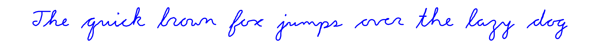
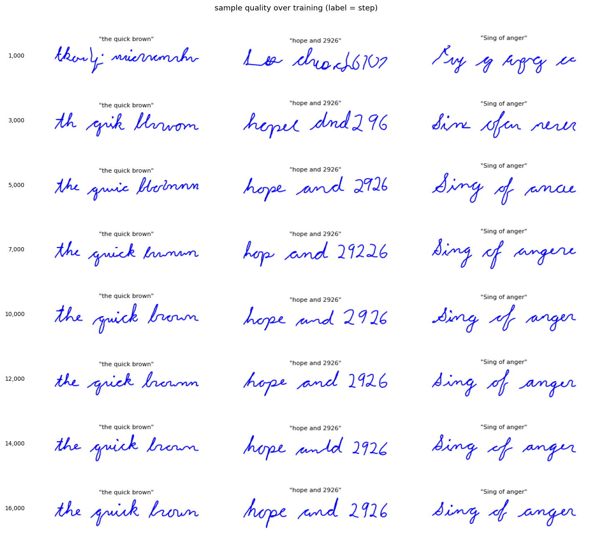
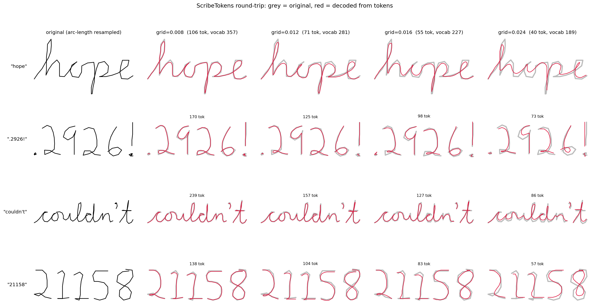
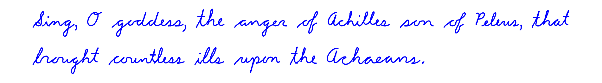

# pengpt

A minimal, general-purpose transformer for pen strokes. Give it a corpus of pen
trajectories — handwriting, sketches, anything drawn with a stylus or mouse —
and it learns to generate more of them, conditioned on text.

This is a ground-up rewrite of
[cursivetransformer](https://github.com/greydanus/cursivetransformer)
([paper](https://arxiv.org/abs/2504.00051) ·
[blog post](https://greydanus.github.io/2025/03/30/cursive-transformer/)),
rebuilt around a representation that is not specific to one writer or one
dataset.



## Quality over a training run



The same three prompts, rendered at each eval. Stroke control and slant arrive
almost immediately; spelling follows. All three prompts are correct by step
10,000, about 25 minutes in, and the rest of the run sharpens the penmanship.

## Quickstart

```bash
pip install -e .          # torch, numpy, matplotlib
pip install -e ".[dev]"   # + pytest
pytest tests/             # ~1 second
```

Train — about 45 minutes on an M-series laptop, no GPU rental needed:

```bash
python train.py --dataset data/bigbank_3500.json.zip --out_dir out
```

The best checkpoint lands in `out/`, and `out/progress/` gets one image per
eval: the same prompts every time, so the strip tracks the model rather than
the prompt. Stack them with `python progress.py`, or put real handwriting
beside generations for the same text with `python compare.py`.

Add `--wandb --wandb_entity you` for Weights & Biases logging (optional).
Resume with `--resume out/best.pt`. For a faster run, `--n_layer 3` roughly
halves the time and scored within noise of the default in ablations.

Generate handwriting from a trained model:

```bash
python sample.py --checkpoint out/best.pt --text "The quick brown fox jumps over the lazy dog"
```

If a word comes out misspelled, note its index (`--show_indices`) and regenerate
just that word with `--redo 3,7`.

## How it works

**Tokenization** (`pengpt/tokenizer.py`) is
[ScribeTokens](https://arxiv.org/abs/2603.02805). Pen coordinates are quantized
to an integer grid, and motion becomes a walk on that grid: eight compass
directions plus `DOWN` and `UP`. Movement between grid points is decomposed with
Bresenham's line algorithm, so any path is representable by ten base symbols.
Byte pair encoding then merges recurring runs — a common curve becomes a single
token — which is what keeps sequences short.



*Grey is the original, red is decoded from tokens. `grid=0.020` is the default:
reconstruction error stays inside the width of a pen stroke at 99 tokens per word.*

**Model** (`pengpt/model.py`): a small GPT-style decoder (~430k params at
default size) with cross-attention over the character embedding of the text
prompt, in the makemore/nanoGPT lineage.

**Data** (`pengpt/data.py`): each example is one word, an `(N, 3)` array of
`(x, y, pen)`. Training examples pack random words together until the block is
full, so a few thousand words become effectively unlimited examples and nothing
is ever truncated mid-word.

## Why ScribeTokens

The original used polar `(theta, r)` bins, two tokens per pen point. Measured on
bigbank_3500, ScribeTokens is better on every axis at once:

| | tokens/word | reconstruction error | bits/pen-point | vocab |
|---|---|---|---|---|
| polar bins | 185 | 0.0116 | 13.09 | 525 |
| ScribeTokens | **99** | **0.0061** | **5.94** | **306** |

Trained head to head at matched wall clock, ScribeTokens reached **3.43
bits/pen-point against the polar tokenizer's 7.16** — a 2.1× advantage, while
running *fewer* optimizer steps. BPE is doing real work here: at equal block
sizes, 256 merges scored 1.29 against 2.12 with no merges at all.

Together with a coarser grid and a shorter block, this took a full training run
from **21.5 hours to under an hour** on an M-series laptop. No rented GPU is
needed at this scale.

Two properties matter beyond the numbers:

- **Insensitivity to sampling rate.** Recording the same shape more finely
  changes the tokens little, and changes them not at all once samples are
  dense enough to land in adjacent grid cells. Point density in raw pen data is
  an artifact of the recorder, so a mouse, a 100 Hz digitizer, and a
  preprocessed public dataset land in nearly the same representation. Measured
  at the default grid, two samplings of one curve reconstruct to within two
  grid cells of each other; exact token equality needs a coarser grid than the
  default.
- **No out-of-vocabulary.** A grid walk always decomposes into base tokens. Bin
  tables have to be retuned per dataset and silently clip whatever falls
  outside them.

This also removes machinery the old code needed. Because ScribeTokens encodes
absolute grid position, words carry their own height and the hardcoded
`STARTS_AT_BOTTOM` / `STARTS_AT_TOP` character tables — one writer's alphabet,
meaningless on any other dataset — are gone, along with the inter-word carriage
jump formula. Generation no longer needs to be seeded with real strokes from the
training set.

## Writing a paragraph

```bash
python iliad.py --checkpoint out/best.pt
```



Long text is generated a few words per model call and laid out with wrapping.
If a word comes out wrong, find its index with `--show_indices` and regenerate
only that word with `--redo 3,7`.

## Training on your own pen data

The dataset format is a JSON list (optionally zipped), one item per word:

```json
{"text": "hello", "points": [[0.0, 0.1, 1], [0.01, 0.12, 1], ...]}
```

`pen` is 1 while the pen is down; a `pen = 0` point is a lift. y grows downward,
the baseline sits near y = 0, and lowercase letters are roughly 0.1–0.3 units
tall.

- **Collect your own**: open `collect.html` in a browser, write with a
  mouse/trackpad, export JSON. This is how the bundled `bigbank_3500` dataset
  (3,500 words, one author) was made.
- **Convert existing datasets**: see `pengpt/convert.py`.
- **Irregular point density?** Set `--spacing 0.02` to resample to uniform arc
  length. The bundled data does not need this: `collect.html` records a point
  every time the pen has moved a fixed distance, so its spacing is already
  uniform at ~0.011 and resampling only discards detail. Time-sampled sources
  like IAM do need it.
- The character vocabulary is derived from the data and stored in the
  checkpoint, along with the BPE merges.

## Pen data that is not handwriting

Nothing in the tokenizer knows about letters or words — it encodes pen motion on
a grid. Sketches, signatures, diagrams and gestures work with two settings:

```bash
python train.py --dataset data/sketches.json --max_words 1 --augment general
```

`--max_words 1` treats each example as one trajectory, which makes the `WORD`
separator inert. `--augment general` drops the shear: it is always negative, so
it imposes an italic slant rather than jittering, and it presumes a baseline to
slant about. `--augment none` disables augmentation entirely, and `--rotate 10`
adds rotation, which suits data with no canonical upright.

Ink scale is the one thing to get right. The grid is a fixed distance, so tokens
per example scale with how large the drawing is; `convert.py` normalizes to the
bundled data's scale, and `train.py` warns with a suggested `--grid` if a dataset
arrives at a different one.

Measured on the bundled cursive, the shear earns its place: removing it costs
0.79 → 0.95 bits per pen-point even with 37% more optimizer steps. That is a
statement about this dataset, not about pen data in general.

## Quick, Draw!

[Quick, Draw!](https://github.com/googlecreativelab/quickdraw-dataset) is 50M
doodles across 345 categories under CC-BY-4.0. Its format is already what pengpt
expects — strokes with pen lifts at the boundaries — so the converter is thin:

```bash
python -m pengpt.convert --quickdraw cat.ndjson --out data/cats.json
python train.py --dataset data/cats.json --max_words 1 --augment general
```

Much of it is sloppy, and mean quality matters more than raw count, so
`rank_quickdraw.py` keeps the best fraction of each category:

```bash
python rank_quickdraw.py --raw_dir qd_raw --out data/top25.jsonl --resume
```

It renders each drawing, embeds it with CLIP, and scores it with a probe
calibrated on 210 hand-judged drawings (`pengpt/quality.py`). Held out, the
quarter it keeps is 83% good-or-better against a 48% base rate, with none of the
judged junk surviving — a good coarse filter, not a fine ranking. Selection is
per category so class balance survives, output streams to JSON Lines, and
`--resume` picks up after a crash.

Throughput is 204 drawings/s here, so the full corpus is about 68 hours; a
rented GPU does it in one to three, since 92% of the time is CLIP inference.

## Repo map

```
pengpt/config.py     dataclass configs + CLI
pengpt/tokenizer.py  ScribeTokens + BPE + char tokenizer
pengpt/data.py       loading, augmentation, PenDataset
pengpt/model.py      PenTransformer + checkpoint I/O
pengpt/sampling.py   generation, paragraph layout, plotting
pengpt/convert.py    external dataset converters
pengpt/quality.py    rank drawings, to filter a crowd-sourced corpus
train.py             training loop
sample.py            write arbitrary text
iliad.py             write the Iliad opening
compare.py           real handwriting beside generations
progress.py          contact sheet of samples over a run
rank_quickdraw.py    filter Quick, Draw! to its best drawings
collect.html         self-contained data collection page
```

By Sam Greydanus. Cursive model and dataset from the cursivetransformer project
with Zachary Wimpee.
